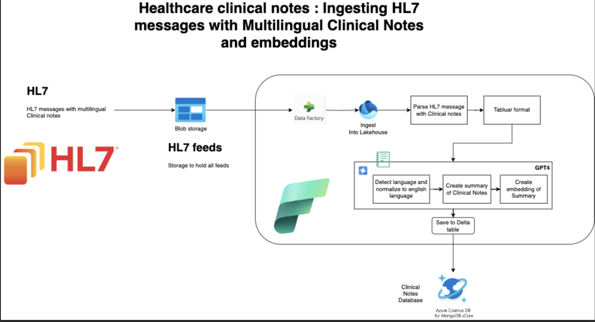

# Hack Together: The Microsoft Fabric Global AI Hack Submission March 2024

## Project : Multilingual Clinical Notes Ingestion 

`Source: https://openai.com/dall-e-3`

# Introduction

In the ever evolving landscape of global health care, effective communication and data management are paramount. With the rise of diverse patient populations and multilingual documentation, the need for a system that can seamlessly integrate and interpret clinical notes from various languages has never been more pressing. The Multilingual Clinical Notes Analysis Project represents a POC solution designed to address this challenge head on using Azure Fabric, Azure OpenAI and Azure CosmosDB MongoDB vCore.

By integrating Health Level 7 (HL7) standards, the project ensures a smooth transition from traditional record-keeping to a more sophisticated, AI-powered data management system. The goal is to improve the efficiency of healthcare application, enhance patient care, and unlock new insights from clinical data that were previously inaccessible due to language barriers. This can be further expanded by using RAG, Users can interact with the more precise information retrieval from clinical note.

# Architecture

# Workflow Overview

Ingestion: HL7 messages containing clinical notes might be sent via different Interfacing engine to Blob storage(Manually uploading file to blob for this poc) collected and stored.

Blob Storage: Initial raw data is kept in blob storage for durability and accessibility.

Data Processing: In Azure Fabric Data Factory is used to get the new HL7 files from BLOB, which is then ingested into Lakehouse.

NLP Enrichment: Language detection and normalization occur before GPT-4 generates summaries and embeddings of the clinical notes.

GPT-4 is used to create summaries of the clinical notes. It is also used to create embeddings of the summary, which are vector representations of the summary text useful for various machine learning tasks.

Delta Storage: The enriched data is stored in Delta tables to ensure that it is versioned and queryable.

Database Integration: The processed data is made available through Azure Cosmos DB, which is compatible with MongoDB, for easy application integration. Future the embeddings cab be use for  RAG application for other use cases.

# Fake HL7 message generated by ChatGPT with Spanish(Spanish used for Demonstration purpose only )

MSH|^~\&|HospitalSystem|OutpatientClinic|||20240228||ORU^R01|HL7MSG0001|P|2.5
PID|1|123456789|987654321||Perez^Juan|19750415|M|||123 Calle Falsa^^Ciudad^Estado^12345^MX||(555)555-5555|||S||1234567890|||||||||||
PV1|1|O|OutpatientClinic^^^HospitalSystem^HOSP||||1234^Garcia^Maria^^^^^^HospitalSystem|||2024|||||||1234^Garcia^Maria^^^^^^HospitalSystem|||||||||||||||||||||||||20240228|
OBX|1|TX|HIS0001^Historia Clínica^HospitalSystem||El paciente presenta un historial de tres días de dolor abdominal no específico, de intensidad moderada, localizado en el abdomen inferior. No hay síntomas asociados de fiebre, vómitos o diarrea. Historia médica pasada significativa por episodios similares en el último año, evaluados sin un diagnóstico específico. Examen físico revela una leve sensibilidad en los cuadrantes abdominales inferiores, sin rebote ni defensa. Plan: Se recomienda una ecografía abdominal para descartar cálculos biliares. Evaluación adicional con gastroenterología puede ser necesaria basada en los resultados de la ecografía.|||F|||20240228|20240228||||||

# The sentence translates to English as:

"The patient presents a three-day history of nonspecific abdominal pain, moderate in intensity, localized in the lower abdomen. There are no associated symptoms of fever, vomiting, or diarrhea. Significant past medical history for similar episodes in the last year, evaluated without a specific diagnosis. Physical examination reveals slight tenderness in the lower abdominal quadrants, with no rebound or guarding. Plan: An abdominal ultrasound is recommended to rule out gallstones. Further evaluation with gastroenterology may be necessary based on the ultrasound results."

# Sample Prompt Used:

I have a clinical note that I need translated into English. The note contains important medical information about a patient's condition, symptoms, medical history, physical examination findings, and the recommended plan of action. It is written in a language other than English and contains specific medical terminology that is crucial to the patient's care. The translation must accurately convey the original meaning and medical terms to ensure the information is communicated effectively. Please translate the following clinical note into English.

